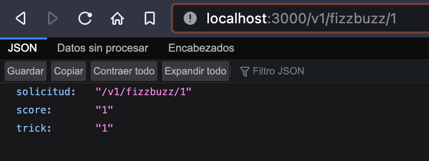
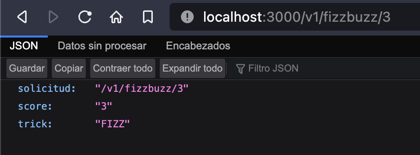
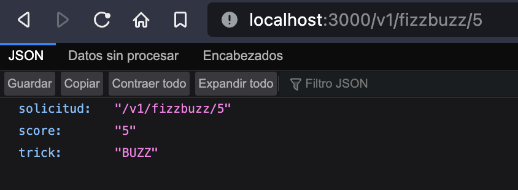
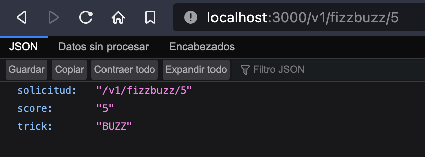
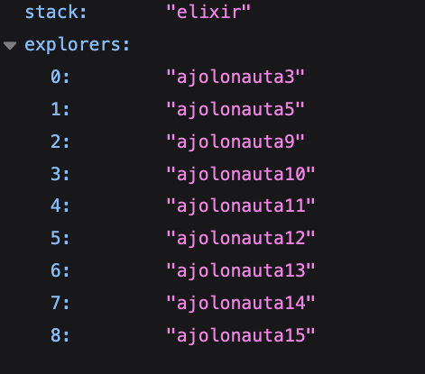
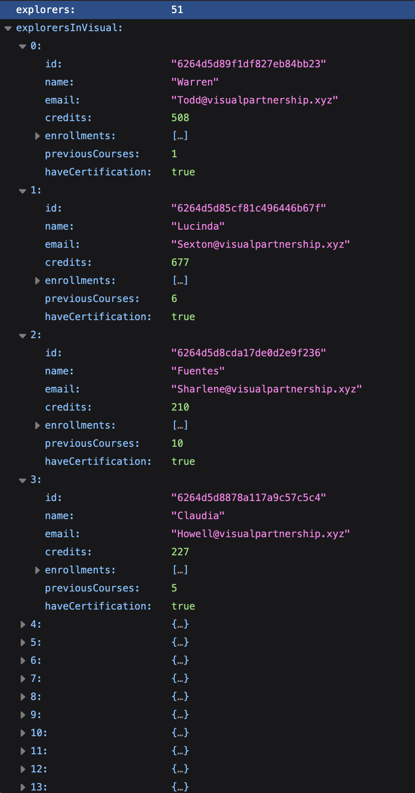
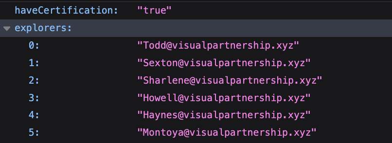
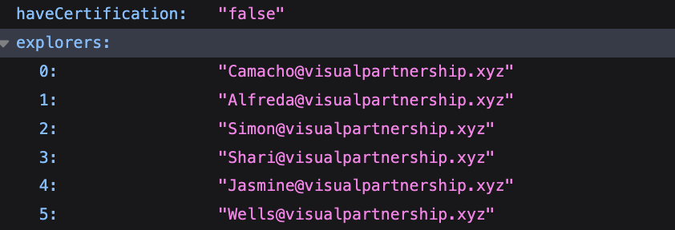
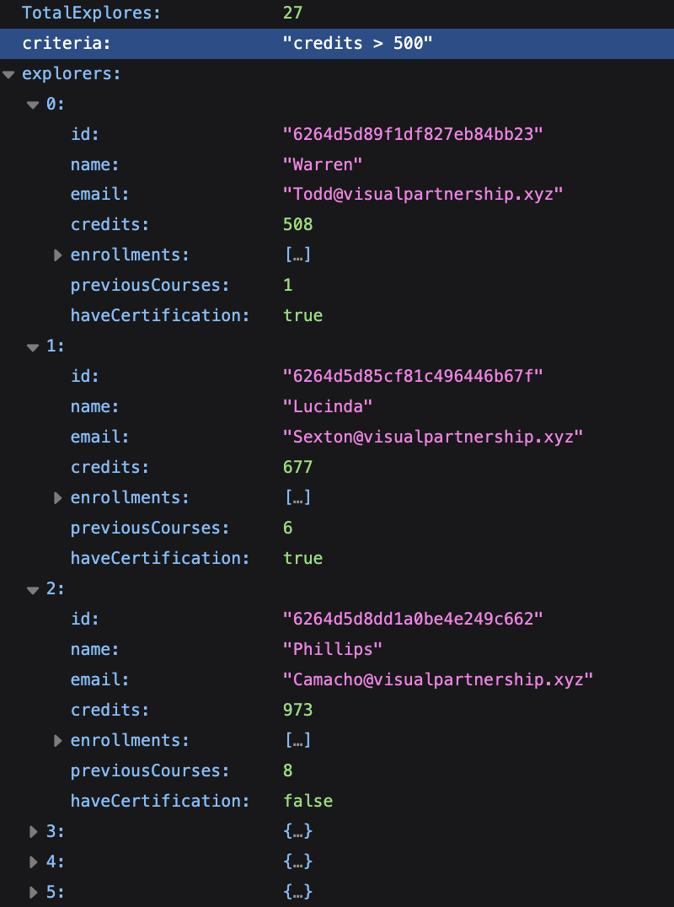
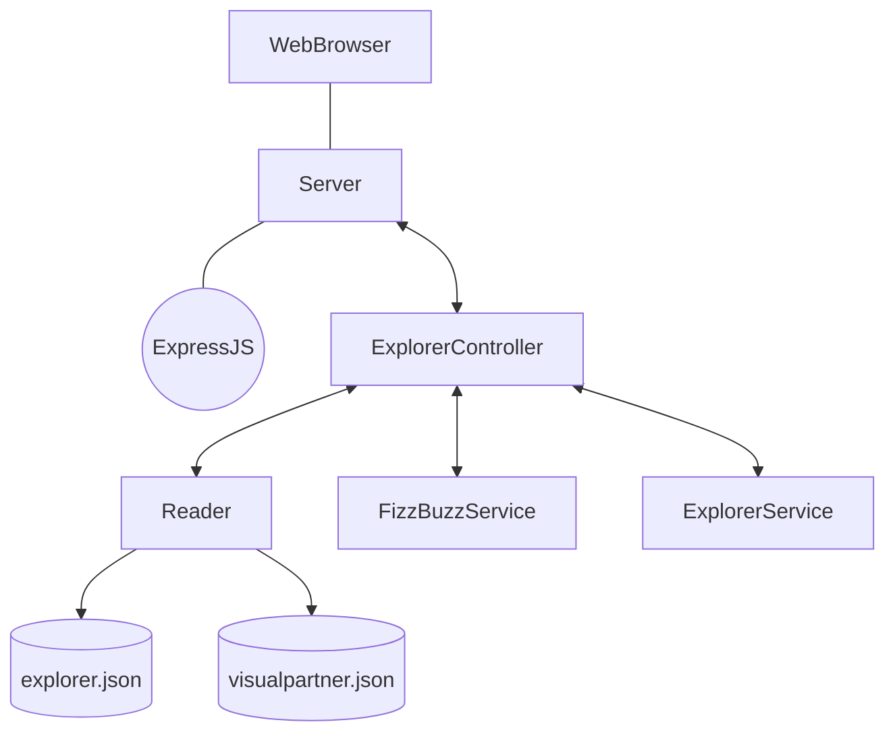

# 3.- Ejercicio para "FizzBuzz"

<!--Endpoints con expressJs + contribución OpenSource + Code Challenge! -->
<!-- "Cobraremos por cada request que recibamos." -->

## Agregando nuevos endpoints.

Se agregan nuevos requeriemientos basados en la práctica de [Launch_X-FizzBuzz](https://github.com/mabvmex/launch_x-API-Fizzbuzz).  
De acuerdo al _'score'_ que se le envíe en la URL, la aplicación regresará una respuesta determinada en formato _**json**_:

- Se entregará _`'FIZZ'`_, si se envía como _'score'_ un número que sea multiplo de `3`.
- Se entregará _`'BUZZ'`_, si se envía como _'score'_ un número que sea multiplo de `5`.
- Se entregará _`'FIZZBUZZ'`_, si se envía como _'score'_ un número que sea multiplo de `3 y 5`.
- Se entregará el _`'score'`_ mismo si no se cumple ninguno de los casos anteriores.

 
Remplaza `:score` por el número que deseas envíar  
El endpoint es:

> localhost:3000/v1/fizzbuzz/:score
> &nbsp;

 &nbsp;&nbsp;
 &nbsp;&nbsp;

 

 &nbsp; &nbsp;
 &nbsp; &nbsp;

 

# 4 Contribución OpenSource: Visual Partnership.
Este apartado se realiza a partir del proyecto de [VisualPartnership](https://github.com/visualpartnership/fizzbuzz).  
El endpoint `/v1/explorer/stack/:stack` devuelve un listado en formato _**json**_ de explorers que contiene a aquellos que utilizan el lenguaje de programación enviado en la petición:

 &nbsp;&nbsp;
 &nbsp;&nbsp;

# 5 Code Challenge

Los endpoints que corresponden al desarrollo del _Code Challenge_ entregaran una respuesta en formato _**json**_ pueden probados de la siguiente manera:

> 1.- localhost:3000/v1/students

-   Esto devolverá una lista con todos los estudiantes con todos sus campos.

  

 

> 2.- localhost:3000/v1/students/email/true

> 2.1.- localhost:3000/v1/students/email/false

-   Esto devolverá una lista con todos los emails de todos los estudiantes según tengan certificación.

 &nbsp; &nbsp;
 &nbsp; &nbsp;

 

> 3.- localhost:3000/v1/students/credits

-   Esto devolverá una lista con todos los estudiantes cuyos credítos correspondan al criterio de filtración.

&nbsp;

# Github Actions
El proyecto está configurado para que automáticamente se ejecuten las pruebas por medio de Github Actions cada vez que se ejecura un comando `push` hacia el repositorio de Github.
 
 

# Dependencias
El proyecto hace uso de las ssiguentes dependencias:

- `Eslint`: Se utiliza para darle formato de código según las guías de estilo de más aceptadas.
- `Jest` Se utiliza para Pruebas unitarias del código del proyecto.
- `SuperTest` Se utiliza de manera complementaria para realizar pruebas Unitarias a los endpoints del servidor de Express.
- `Express` es la dependencia que se utiliza para poder crear el servidor y sus funciones de consumo de endpoints (URLs).

 
 
 

# Diseño de componentes

